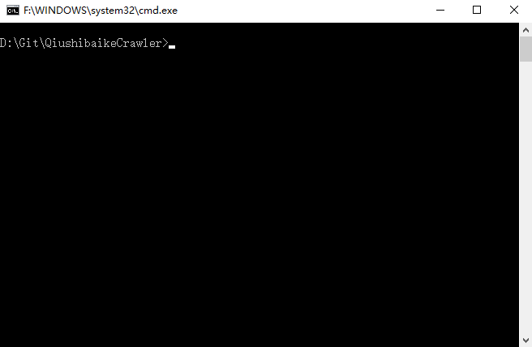

# QiushibaikeCrawler

这是一个简单的网络**爬虫**应用，爬取**糗事百科**中的段子，在**命令行界面**实现用户交互。

## 前提

> Git 和 Python 不仅需要安装到你的硬盘中，并且还需要将它们的可执行文件加入到系统环境变量哦！

- Git
- Python 2.7

## 启动

1. 下载文件

	在你的硬盘的任意位置（最好不是系统盘），打开命令行界面，键入以下命令：

	```shell
	git clone https://github.com/ShawnyXiao/QiushibaikeCrawler.git
	```

	或者直接点击 Download ZIP 按钮下载文件压缩包，然后解压。

2. 启动应用

	进入文件目录并启动应用。在刚才的命令行界面中键入以下命令：

	```shell
	cd QiushibaikeCrawler
	python qiushibaike_crawler.py
	```

	若是看到欢迎致辞，就代表应用已成功启动拉！

## 使用

- ```Enter```：读取下一条段子
- ```Q```：退出系统

## 截图

